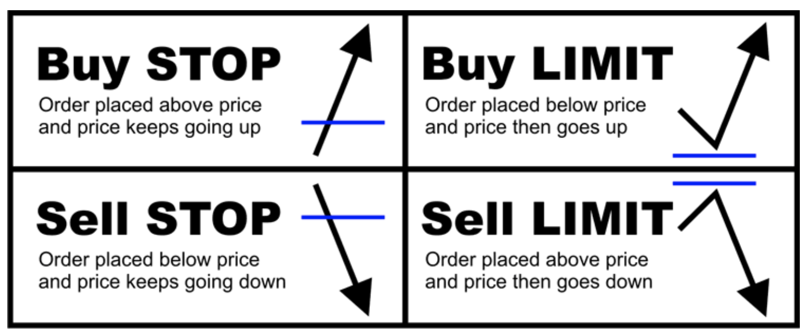

# Order Types

## Market Order

A **Market Order** is an order that executes immediately at the best available price. This order is seen as riskier because in volatile markets the order can be executed at a price nowhere near where the stock is currently trading.

## Limit Order

A **Limit Order** is a bid to buy or sell a stock at a price that you specify. The main difference between a limit order and a market order is that a limit order does not guarantee your stock will be filled.

*Avoid limit orders at the beginning - they cap your upside, as 99.99% of the time you sell on a limit order the stock will continue upwards. And if you buy on a limit then the stock will usually continue downwards.*

## Stop Orders

Also referred to as a **Buy Stop** or **Sell Stop** these are one of the most useful orders. The stop order, unlike the other two orders, remains dormant until the defined price is passed. Once the price is reached, this activates the stop as a market order.

Stop orders help you define your risk. Whenever you buy you should immediately set your appropriate stop to quantify your risk. It is essential to *always* use stops as it gives you protection from a large downside move.

Buy and Sell stop orders are the most used order. We set up our buy stops to trigger us into the trade, then we enter our sell stop to trigger us out of the trade.

## Sell Limit Orders

These are like stop orders, however you can cap the price that you buy or sell at. For example, say TSLA has earnings and we want to put our stop order in at $420.69, but don't want to be paying a crazy amount (say it opens at $500), we put the stop limit at $421.

Stop limit orders are pretty much only ever used during earnings season.

## Good til Canceled (GTC)

This is a time frame you can set on different orders. a GTC order will remain active until you decide to cancel it. Brokerages limit the time you can keep an order open to 90 days.

There can also be GTC intraday orders (day), which cancel upon the market's close. For most buy stops it's best to use this and then if/when you no longer like the set up if it hasn’t triggered, simply cancel the order. 