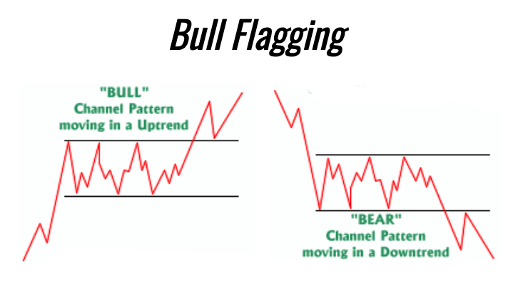
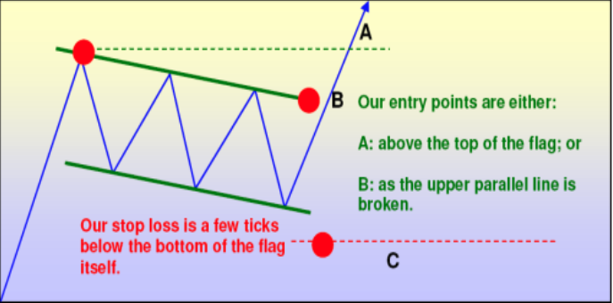

# Stock Patterns

## Bull Flagging

The **bull flag** is a continuation pattern. Stocks can't go straight up, so a bull flag is viewed as a consolidation period within an uptrend. Three steps:

1. The stock uptrends ->
2. A consolidation period begins as the stock creates a bull flag
3. The stock 'breaks out' as it begins it's next leg in the uptrend.

The technical buy point is when price crosses the upper trend line, or called the ***resistance*** of the flag area. You want to see this price action occur as volume increases - aka you want to buy through resistance on increased volume, as the increased volume confirms that the big buyers are on the same side of the trade as you.

1. **"Entry Price"** defined: Based on technical analysis, these are typically levels of support and resistance that, if breached, could potentially lead to momentum in a given direction.

2. **"Target Range"** defined: The price range which the stock could potentially reach, based on your opinion.

3. **"Stop-Loss Level"** defined: The level you could potentially place a stop-loss order based on the hypothetical trade in order to manage risk. 
